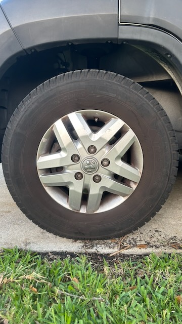

# Spare Tire

The Thor Sequence does not come with a spare tire from the factory. Getting a flat far from a service center is a serious problem in a vehicle this size, so adding a spare was a priority.

## Why

Class B+ motorhomes are heavy enough that a standard roadside assistance call often requires a specialized truck. Having a matching spare on board means a flat can be dealt with immediately rather than waiting hours for help.

## What Was Done

The tire carrier mounts to the roof rails via the Thule WingBar Evo cross bars.

Steps:

1. Removed the front Thule WingBar Evo and slid the solar panel forward to make room for the tire.
2. Temporarily removed both Thule WingBar Evos.
3. Attached the tire carrier to the removed Thule WingBar Evos with four M8x35mm bolts.
4. Reattached both Thule WingBar Evos to the roof rails aft of the solar panel.

## Tools

- 13mm socket wrench (or Crescent wrench)
- Allen wrench (size TBD)

## Photos

## Result

Have not given it a road test yet.

## Parts list

- [Bolts](https://amzn.to/4sNrlWH) — $17
  - Size: M8x35mm
  - 2-4 bolts to attach Thule WingBar Evo to the roof rails.
  - 4 bolts to attach tire carrier to Thule WingBar Evo
- [Tire carrier](https://amzn.to/487S60t) — $60

